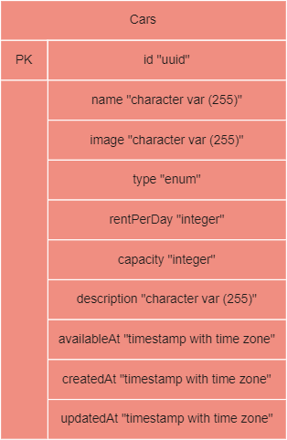

# RESTful  API with ExpressJS
The `index.js` file is a file that contains an HTTP server implementation that implements RESTful API rules written using Express.js and an ORM implementation using Sequelize to connect the HTTP Server with a database created using PostgreSQL. The HTTP server will provide response data in JSON form which will be executed using Postman.

Do the following to run the HTTP server.

## Install ExpressJS
```bash
# NPM
npm install express

# YARN
yarn add express
```

## Install Sequelize
```bash
# Install sequelize
npm install --save sequelize

# Install database
$ npm install --save pg pg-hstore Postgres
$ npm install --save mysql2
$ npm install --save mariadb
$ npm install --save sqlite3
$ npm install --save tedious Microsoft SQL Server
$ npm install --save oracledb Oracle Database

# Installing the CLI
npm install --save-dev sequelize-cli
```

## Run the server in the terminal
```
node index.js
```

## Running Migrations
To create a table in your database, run the following command
```
npx sequelize-cli db:migrate
```

## Running Seeds
If you want to enter sample data in the database
```
npx sequelize-cli db:seed:all
```

## Endpoints

**GET**
> will open the root endpoint with response **{message: “ping successfully"}**

**GET/cars**
> will open a **list of cars**

**GET/cars/:id**
> will open **one car data**

**POST/cars**
```bash
# Create data

{
  "name": string,
  "image": string,
  "type": enum("small", "medium", "large"),
  "rentPerDay": integer,
  "capacity": integer,
  "description": string,
  "availableAt": date
}
```
> will return the response **data of the cars** that have been created

**PUT/cars/:id**
> will return the existing **cars data** response updated

**DELETE/cars/:id**
> will return the existing **cars data** response erased

## ERD


